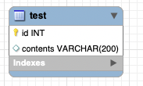

# jeju
## http://www.jeju50days.com/

* 프런트
- 자바스크립트
- 리액트

* 백엔드
- 노드js
- mysql

### 배포에 참고한 사이트
https://medium.com/@bdv111/aws-ec2%EC%97%90%EC%84%9C-nginx%EB%A1%9C-react-%EC%95%B1-%EC%A7%81%EC%A0%91-%EB%B0%B0%ED%8F%AC%ED%95%98%EA%B8%B0-c1e09639171e

### client
* 아파치서버이용해 배포하는것으로 수정됨 이하는 의미없음. 서버만 동작하면됨
* http://52.79.237.69:3000
* pm2 start npm -- start
* 추후에 nginx으로 build 정적 배포 하도록 수정하기 

### server
* http://52.79.237.69:3001/api
* pm2 start sudo server.js

### ERD

* sudo mysql -u root -p

### 호스팅에 도움이 된 블로그
* https://velog.io/@pinot/AWS-Ubuntu%EB%A1%9C-nginx-reverse-proxy-%EC%84%A4%EC%A0%95%ED%95%98%EA%B8%B0

### 터미널 접속
* ssh -i jeju.pem ubuntu@52.79.160.44 

### src 파일 정의.
* Container: 다른 container또는 section을 갖는 최상위 묶음 단위
* Section: 의미로 구분되는 기능 영역의 구분
* Component: List를 구성하는 단위
* item: Compoenent나 Section을 구현하는데 필요한 더 작은 단위

### mysql 한글 입력도 안될때 
* https://all-record.tistory.com/183
* 며칠을 헤멘 후 위 링크를 보고 재설치를 했다..
* 아니다 이걸봐라
* https://www.lesstif.com/dbms/mysql-rhel-centos-ubuntu-20775198.html

### ec2 접속
* ssh -i jeju.pem ubuntu@52.79.160.44 

### ssl 설정 완료